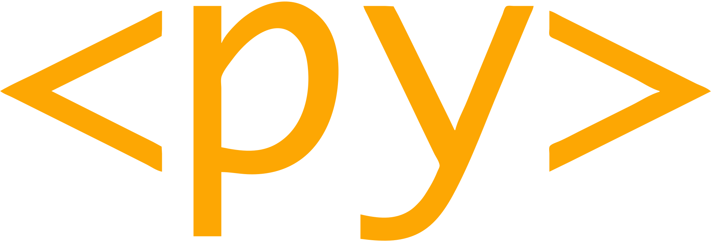

<h1 style="text-align: center; font-weight: bold;">PyScript is a platform for Python in the browser.</h1>

## PyScript is...

* **Easy**: your apps run in the browser with no complicated installation
  required.
* **Expressive**: create apps with a powerful, popular and easy to learn
  language like Python.
* **Scalable**: no need for expensive infrastructure ~ your code runs in
  your user's browser.
* **Shareable**: applications are just a URL on the web. That's it!
* **Universal**: your code runs anywhere a browser runs... which is
  _everywhere_!
* **Secure**: PyScript runs in the world's most battle-tested computing 
  platform, the browser!
* **Powerful**: the best of the web and Python, together at last.

## What's next?

<dl>
  <dt><strong>I'm a beginner...</strong></dt>
  <dd>Welcome! PyScript is designed to be friendly for beginner coders. The
  best place to start is by reading our
  <a href="beginning-pyscript">beginning PyScript guide</a>
  and then using 
  <a href="https://pyscript.com/" target="_blank">pyscript.com</a>
  to create your first apps. Having problems? Check out our
  <a href="faq">frequently asked questions</a>.</dd>
  <dt><strong>I'm already technical...</strong></dt>
  <dd>The beginner docs will set you up with a simple coding environment. For
  more in-depth technical coverage of PyScript, consult the
  <a href="user-guide">user guide</a>. The
  <a href="examples">example applications</a> demonstrate many of the features
  of PyScript. The <a href="faq">FAQ</a> contains lots of technical detail.</dd>
  <dt><strong>I want to contribute...</strong></dt>
  <dd>
    
Welcome, friend!
    PyScript is an <a href="license/">open source project</a>, we expect
    participants to act in the spirit of our
    <a href="conduct/">code of conduct</a> and we have many 
    ways in which <a href="contributing/"><u>you</u> can contribute</a>.
    Our <a href="developers/">developer guide</a> explains how to set
    up a working development environment for PyScript.

  </dd>
  <dt><strong>PyScript.com vs PyScript.net...</strong></dt>
  <dd>
    
<a href="https://pyscript.com/" target="_blank">PyScript.com</a> is a free hosting service provided to the PyScript community by Anaconda. You can explore projects 
    created by others, collaborate on their vision, or start your own projects. On <a href="https://pyscript.net/" target="_blank">PyScript.net</a>, 
    you can find all the latest news about PyScript, learn how to get started with PyScript, and 
      access links to our social media and other relevant channels.

  </dd>
  <dt><strong>Just show me...</strong></dt>
  <dd>That's easy! Just take a look around
  <a href="https://pyscript.com/" target="_blank">pyscript.com</a> - our
  platform for developing and hosting PyScript applications. By using
  using this service you help to support and sustain the development and growth
  of the open-source PyScript project.</dd>
  <dt><strong>I want support...</strong></dt>
  <dd>
    
Join the conversation on our
    <a href="https://discord.gg/HxvBtukrg2" target="_blank">discord server</a>,
    for realtime chat with core maintainers and fellow users of PyScript.
    Check out <a href="https://www.youtube.com/@PyScriptTV">our YouTube
    channel</a>, full of community calls and show and tells.
    Explore
    <a href="https://learning.anaconda.cloud/" target="_blank">educational</a>
    and
    <a href="https://www.anaconda.com/professional-services" target="_blank">commercial</a>
    support provided by our open source sponsor 
    <a href="https://anaconda.com/" target="_blank">Anaconda Inc</a> (this
    helps pay for and sustain PyScript!).

  </ul></dd>
</dl>
